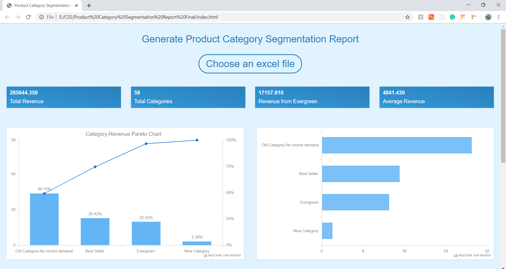

# product-segmentation-report
Product Segmentation Dashboard

Product Segmentation Dashboard using the product category performance data from Excel sheet.

The Category details table has a filter to show category data for various category segments and each column has an option to sort.

